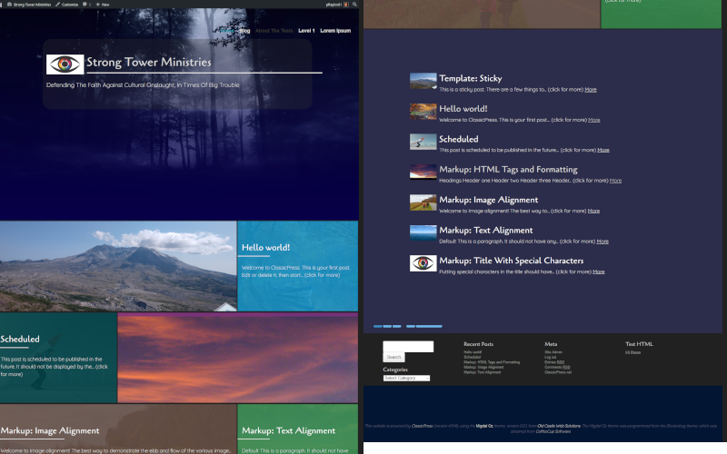

# Migdal Oz Instructions

## Read Me File
The READ ME file can be found at [./README.md]()

## Installation
This is an independent theme. Its code is held at Github. ([https://github.com/pftaylor61/migdaloz](https://github.com/pftaylor61/migdaloz)). Download a zip file of the theme. In your Wordpress or ClassicPress installation, use Appearance > Themes > Add New > Upload Themes to locate the zip file and upload it. Click on the option to activate the theme.

## Migdal Oz Site Structure
Migdal Oz uses one structure for the home page and a structure for all other pages, posts etc.
# Home Page
The Home Page displays the most recent 6 posts in a staggered grid arrangement. 

The post's featured image can be seen as the background to each panel. Hovering over the panel will bring the featured image clearer. If a featured image has not been set for the post, then the theme chooses a default image. However, you can change all the default background images, by using Appearance > Theme Options > Frontpage Settings. In addition, the background of the home page and of the other pages can be set using Appearance > Theme Options > More Basic Settings.
# Logo
The logo can be changed using the Customization system.