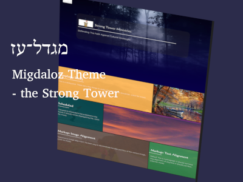

# Migdal Oz
**(meaning "Strong Tower")**

* Theme Name:   Migdal Oz
* Theme URI:    https://oldcastleweb.com/themes/migdaloz
* Description:  Migdal Oz is a child theme of Qohelet
* Author:       Old Castle web solutions
* Author URI:   https://oldcastleweb
* Version:      1.2.0
* License:      GNU General Public License v3 or later
* License URI:  http://www.gnu.org/licenses/gpl-3.0.html
* Text Domain:  migdaloz
* GitHub Theme URI: https://github.com/pftaylor61/migdaloz
* Tags:

    Migdal Oz - a WordPress or ClassicPress theme from Old Castle Web Solutions
    <http://oldcastleweb.com>
    Copyright (C) 2019 Paul Taylor

    This program is free software: you can redistribute it and/or modify
    it under the terms of the GNU General Public License as published by
    the Free Software Foundation, either version 3 of the License, or
    (at your option) any later version.

    This program is distributed in the hope that it will be useful,
    but WITHOUT ANY WARRANTY; without even the implied warranty of
    MERCHANTABILITY or FITNESS FOR A PARTICULAR PURPOSE.  See the
    GNU General Public License for more details.

    You should have received a copy of the GNU General Public License
    along with this program.  If not, see <http://www.gnu.org/licenses/>.

## Description

Migdal Oz is a fully featured theme, built on the framework of the OCWS theme Qohelet. It was programmed from the Shutterbug theme. 

SPECIALNOTE: The Migdal Oz theme was programmed from the Shutterbug theme, which was obtained from <a title="Coffee Cup Software" href="https://themes.coffeecup.com/shutterbug.html">CoffeeCup Software</a>.

## Version 1.1.0
* Tag and Category buttons added for archive lists, category lists, and posts.

## Version 1.1.0
* Full support for Woocommerce and Classic Commerce has been added.
* Also, the display for featured images in pages and posts has been improved.

## Version 1.0.2
Minor edits to suit a website

## Version 1.0.0
The first version to be ready for deployment. I expect there to be quite a few amendments, before it is fully stable.

## Version 0.0.1
The initial development version.

## Instructions and Setup

When this theme is ready for release, there will be a new .md file (INSTRUCTIONS.md) giving details on how to install the theme, and to make initial admin changes.